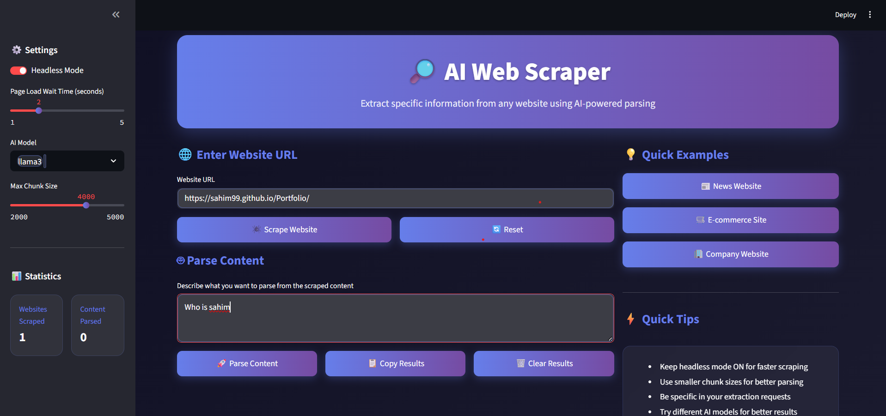

# 🔎 AI Web Scraper

A modern, AI-powered web scraping tool that extracts specific information from any website using intelligent parsing.

## ✨ Features

- **🌐 Smart Web Scraping** - Fast, headless browser scraping with optimized Chrome settings
- **🤖 AI-Powered Parsing** - Extract specific data using local LLM (Ollama) with intelligent content structuring
- **🎨 Modern UI** - Beautiful dark theme with gradient accents and responsive design
- **⚡ Ultra-Fast** - Optimized for speed with progress tracking and dimming effects
- **📊 Structured Output** - Clean, formatted results with no blank boxes
- **🛠️ Easy Setup** - Simple installation and configuration
- **🔄 Real-time Progress** - Visual progress bar with status updates during AI processing
- **🎯 Smart Validation** - Intelligent result filtering to prevent empty or invalid outputs

## 🚀 Quick Start

### Prerequisites

1. **Python 3.8+** installed
2. **Ollama** installed and running locally
3. **Chrome/Chromium** browser installed

### Installation

1. **Clone or download** this project
2. **Install dependencies:**
   ```bash
   pip install -r requirements.txt
   ```

3. **Test installation:**
   ```bash
   python test_imports.py
   ```

4. **Start Ollama** (if not running):
   ```bash
   ollama serve
   ```

5. **Pull the AI model:**
   ```bash
   ollama pull llama3
   ```

### Running the App

```bash
streamlit run main.py
```

The app will open at `http://localhost:8501`

## 📖 Usage Guide

### 1. Enter Website URL
- Paste any website URL you want to scrape
- Click "🕷️ Scrape Website"

### 2. Describe What to Extract
- In the parsing section, describe what information you want
- Examples:
  - "Extract all project names and technologies"
  - "Get all product prices and names"
  - "Find contact information and addresses"

### 3. Parse Content
- Click "🚀 Parse Content"
- Watch the progress bar with real-time status updates
- AI will extract the requested information
- Results appear in a clean, formatted card (no blank boxes!)
- Right side dims during processing for better UX

## ⚙️ Settings

### Sidebar Options:
- **Headless Mode** - Faster scraping (recommended ON)
- **Page Load Wait Time** - How long to wait for page loading (1-5 seconds)
- **AI Model** - Choose between llama3, gpt-4, mistral
- **Max Chunk Size** - Size of content chunks for processing (2000-5000)
- **📊 Statistics** - Track websites scraped and content parsed

## 🔧 Configuration

### Environment Variables
Create a `.env` file for custom settings:
```env
OLLAMA_BASE_URL=http://localhost:11434
CHROME_DRIVER_PATH=./chromedriver.exe
```

### Model Configuration
The AI model can be configured in `parse.py`:
```python
model = OllamaLLM(
    model="llama3",
    temperature=0.0,
    max_tokens=200,
    timeout=15
)
```

### UI Customization
The modern dark theme can be customized in `main.py`:
- Gradient colors and backgrounds
- Card styling and animations
- Button hover effects
- Progress bar styling

## 🛠️ Troubleshooting

### Common Issues:

1. **"Chrome driver not found"**
   - Download chromedriver.exe for your Chrome version
   - Place it in the project root directory

2. **"Ollama connection failed"**
   - Ensure Ollama is running: `ollama serve`
   - Check if model is pulled: `ollama list`

3. **"Import errors"**
   - Run: `pip install -r requirements.txt`
   - Test with: `python test_imports.py`

4. **"Slow parsing"**
   - Reduce chunk size in settings
   - Use smaller content sections
   - Check Ollama model performance

### Performance Tips:

- ✅ Keep headless mode ON for faster scraping
- ✅ Use smaller chunk sizes for better parsing
- ✅ Be specific in extraction requests
- ✅ Try different AI models for better results
- ✅ Monitor progress bar for real-time feedback
- ✅ Use the dimming effect to know when processing is active

## 📁 Project Structure

```
AI Web Scraper/
├── main.py              # Main Streamlit application
├── scrape.py            # Web scraping functions
├── parse.py             # AI parsing functions
├── requirements.txt     # Python dependencies
├── test_imports.py     # Dependency testing
├── chromedriver.exe    # Chrome driver
└── README.md           # This file
```

## 🔄 Updates

### Latest Improvements (v1.1):
- ✅ **Progress Bar** - Real-time visual feedback during AI processing
- ✅ **Dimming Effect** - Right side dims during processing for better UX
- ✅ **Smart Validation** - No more blank boxes, only valid results displayed
- ✅ **Enhanced UI** - Modern dark theme with gradient accents and hover effects
- ✅ **Optimized Performance** - Faster scraping with improved Chrome settings
- ✅ **Better Error Handling** - Comprehensive fallbacks and user-friendly messages
- ✅ **Structured Content** - Intelligent content organization for better AI parsing
- ✅ **Session Management** - Proper state handling and cleanup

### Previous Improvements:
- ✅ **Ultra-fast parsing** - Single chunk processing
- ✅ **Structured data** - Preserves HTML structure
- ✅ **Clean output** - No verbose explanations
- ✅ **Modern UI** - Dark theme with gradients

## 🤝 Contributing

1. Fork the repository
2. Create a feature branch
3. Make your changes
4. Test thoroughly
5. Submit a pull request

## 📄 License

This project is open source and available under the MIT License.

## 🆘 Support

If you encounter issues:
1. Check the troubleshooting section
2. Run `python test_imports.py`
3. Ensure all dependencies are installed
4. Verify Ollama is running
5. Check for blank boxes - they should no longer appear
6. Monitor the progress bar for processing status

## 🎯 Key Features Explained

### Progress Tracking
- **Visual Progress Bar**: Shows 4 stages of AI processing
- **Status Updates**: Real-time text updates during processing
- **Completion Feedback**: Clear success/error messages

### Smart Validation
- **No Blank Boxes**: Results card only appears with valid content
- **Length Validation**: Ensures results have meaningful content (>10 characters)
- **Type Checking**: Validates string format and content structure
- **Error Filtering**: Excludes "No matching information found" responses

### Enhanced UX
- **Dimming Effect**: Right sidebar dims during processing
- **Button States**: Interactive elements disabled during processing
- **Clean Interface**: Modern cards and gradient styling
- **Responsive Design**: Works on different screen sizes

---

**Made with ❤️ using Streamlit | AI Web Scraper v1.1** 